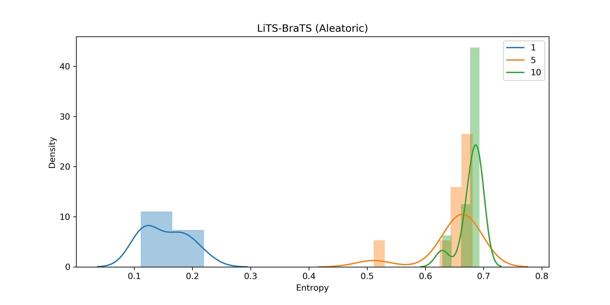
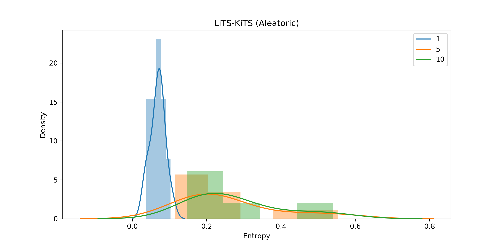
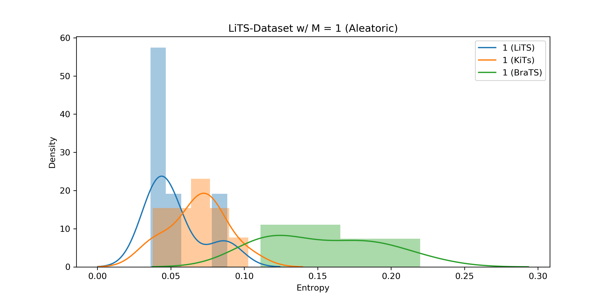
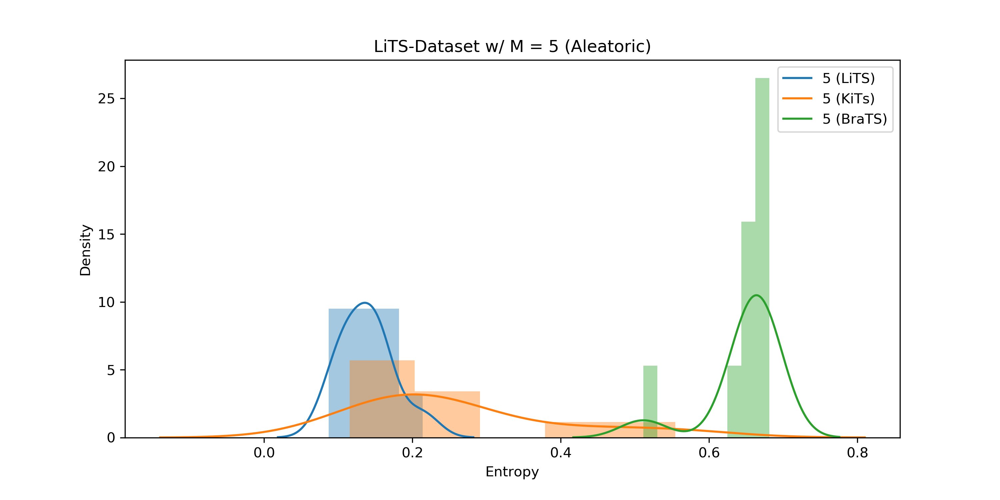
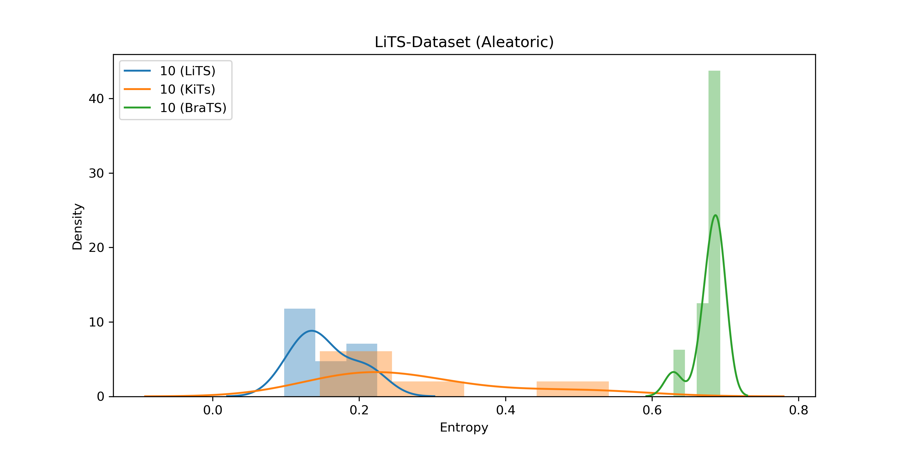

# A Survey of Transfer Learning in Uncertainty Aware Computer-Aided Diagnosis
Project for CSCI-GA 3033 083 / DS-GA.3001-006: Machine Learning for Healthcare, taught by Prof.Rob Fergus, Fall 2021.

## Motivation
Deep learning has seen wide adoption in the medical domain. However, two core problems still remain in the domain of computer-aided diagnosis. One is that medical datasets are often small due to the cost of medical imaging and expert annotations. While recent advances in self-supervised learning seem promising, they are not accessible to many practitioners due to a lack of data and computing resources. Two is that medical practitioners need models with well-calibrated prediction uncertainty for life-critical decisions. Computer-aided diagnosis models perform remarkably when tested against samples from the same data-generating process as the training set, but deteriorates drastically when tested against other samples. This prohibits the application in the medical domain, which requires both well-calibrated and accurate predictions, along with an accurate quantification of predictive uncertainty. These drawbacks have hampered the mainstream deployment of deep learning models in the medical domain. Hence, we decided to study two widely applicable methods that are easily accessible to many practitioners trying to apply their machine learning skills to high-risk decision-making settings. Therefore, in this final project, we investigate the use of transfer learning and uncertainty quantification for computer-aided diagnosis models.
Despite the recent success of medical deep learning, two fundamental problems remain. One is that medical datasets used for supervised training are often small due to the cost of medical imaging and expert annotations. Two is that medical practitioners need models with well-calibrated prediction scores and uncertainty estimates for life-critical decisions. To address these difficulties, we examine transfer learning and uncertainty quantification methods. We find that a multi-headed density network co-trained on multiple medical imaging datasets accelerates convergence when transferred to a nodule detection task, that such a model can effectively quantify the total predictive uncertainty by modeling aleatoric and epistemic uncertainty with density predictions and the Monte Carlo dropout, and that an ensemble of these networks trained with fast gradient sign method data augmentation can detect out-of-distribution samples.

## Data Collection
1. The Liver Tumor Segmentation Benchmark (LiTS) 2017
2. The Brain Tumor Segmentation Challenge (BraTS) 2020
3. The Kidney Tumor Segmentation Challenge 2021
4. LUNA16 dataset

## Modeling and Analysis

### Brain Tumor Segmentation:

### Kidney Segmentation:

### Out-of-distribution detection:
#### LiTS-BraTS

#### LiTS-KiTS

#### Ensemble size comparison:
M = 1

M = 5

M = 10

## Paper
Full paper can be found [here].
